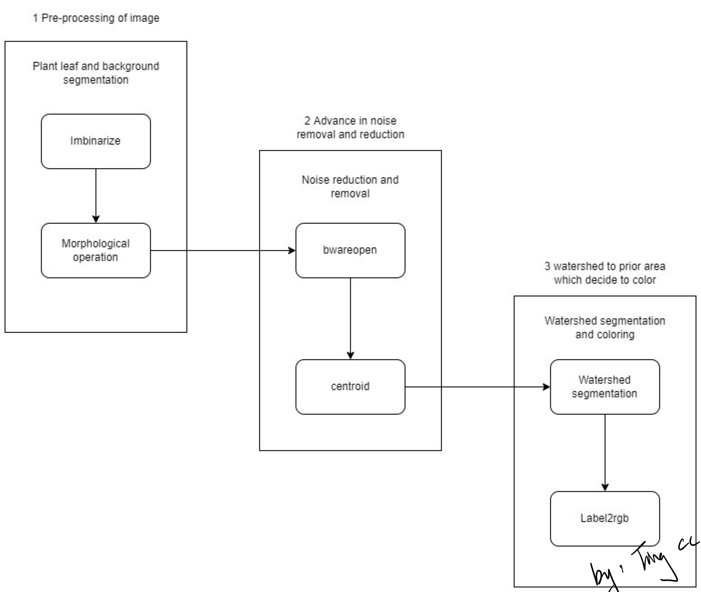

# Leaf-Detection-and-Segmentation
# 1. Introduction
Image-based segmentation is now a cultivate and flourishing area for either image processing or computer vision. At most of the time and situation, this technic could be use and apply in cell detection, thresholding, medical imaging like locate tumors and etc. 
Our project aim to develop a software solution with MATLAB and its image processing toolbox to process a real leaf image. The coded software solution should be able to detect and segmenting leaves of several given example plants’ images. The result image should be in a black background with the leaf random colours coded at every instance.

# 2. Setup to use
The program can be run by putting in source image, and changing the path name

% Image database
folder_name = '**tingcccc_IP**';

%read image, change imread for different images
img1           = imread('**plant001.png**');

# 3. Flow diagram

# 4. Results from example images

# 5. Discussion
# 5.1 Problem faced 
The largest problem that I faced was on the 3rd image, plant003.png. It was because 3rd image have a numbers of shadow area, which those shadow area will make the label2rgb function not accurate as the automated code will assume it was black background. 

# 5.2 Further improvement
